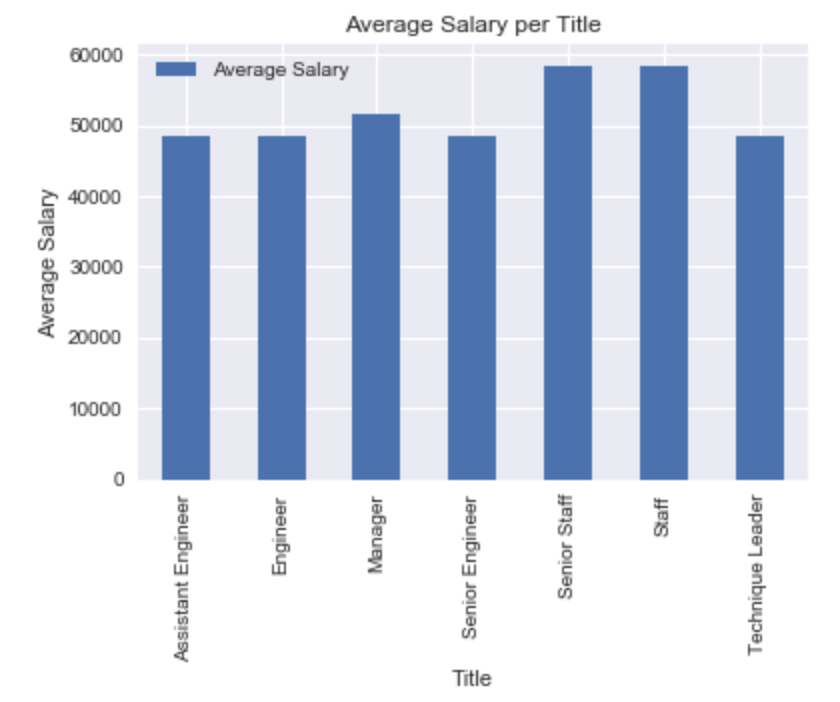

# SQL Project

In this challenge, I was given the task to tranform six large CSV files full of data about a company's employees in the 1980s and 1990s, into useful and meaningful information. The original CSV files can be found in the input_data folder within the EmployeeSQL folder. The files contained information related to the company's departments, dempartment employees, department managers, employees, salaries, and titles. I needed to perform data modeling, engineering and analysis in order to accomplish my goals. My full SQL script can be review in EmployeeSQL>main.sql.

I began by creating an ERD to map my plan for combining the data into relevant and useful datasets, which can be seen below.

Next, I created a tables for the six CSV files within a schema on PostgreSQL. The code for this can be found in EmployeeSQL>input data. After creating the necessary tables with requisite primary and foreign keys, I ran queries to answer the following questions: 

  1. List the following details of each employee: employee number, last name, first name, gender, and salary.

  2. List employees who were hired in 1986.

  3. List the manager of each department with the following information: department number, department name, the manager's   
     employee number, last name, first name, and start and end employment dates.

  4. List the department of each employee with the following information: employee number, last name, first name, and
     department name.

  5. List all employees whose first name is "Hercules" and last names begin with "B."

  6. List all employees in the Sales department, including their employee number, last name, first name, and department name.

  7. List all employees in the Sales and Development departments, including their employee number, last name, first name, and
     department name.

  8. In descending order, list the frequency count of employee last names, i.e., how many employees share each last name.

The sql code for these queries can be found in the EmployeeSQL folder.

Additionally, I analyzed the newly created database information using SQL Alchemy in order to better visualize the data. Specifically, I created a histogram to visualize the most common salary ranges for employees and a bar chart of average salary by title. These charts can be seen below.

